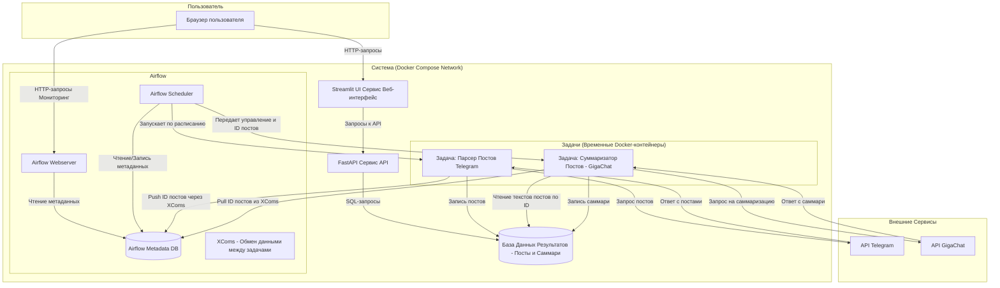

# Суммаризатор Постов Telegram-Каналов на Airflow и GigaChat

Это проект представляет собой автоматизированную систему для сбора, анализа и суммризации текстовых постов из публичных Telegram-каналов. Система использует Apache Airflow для оркестрации задач, GigaChat API для генерации саммари, PostgreSQL для хранения данных, FastAPI для предоставления API к результатам и Streamlit для веб-интерфейса. Все компоненты запускаются в Docker-контейнерах.

## Возможности

*   **Автоматический парсинг:** Сбор новых постов из указанных Telegram-каналов по заданному расписанию.
*   **Суммаризация контента:** Генерация кратких саммари для постов каждого дня с использованием нейросетевой модели GigaChat.
*   **Хранение данных:** Сохранение оригинальных текстов постов и их саммари в базе данных PostgreSQL.
*   **API для доступа к данным:** FastAPI предоставляет эндпоинты для получения списка каналов, саммари и постов.
*   **Веб-интерфейс:** Удобный просмотр саммари и оригинальных постов через приложение на Streamlit.
*   **Мониторинг и управление:** Использование веб-интерфейса Airflow для отслеживания выполнения задач и управления рабочими процессами.

## Архитектура Системы

Система построена на основе микросервисной архитектуры с использованием Docker и Docker Compose.



**Основные компоненты:**

1.  **Apache Airflow:** Оркестратор задач (парсинг, суммризация).
2.  **Задачи Airflow (в Docker-контейнерах):**
    *   **Парсер (`telegram_parser_task`):** Сбор постов из Telegram.
    *   **Суммаризатор (`summarizer_task`):** Генерация саммари через GigaChat API.
3.  **База Данных Результатов (`postgres_results_db_service`):** Хранение постов и саммари.
4.  **FastAPI Сервис (`fastapi_api_service`):** REST API для доступа к данным.
5.  **Streamlit UI (`streamlit_ui_service`):** Веб-интерфейс для просмотра результатов.

## Технологический Стек

*   **Оркестрация:** Apache Airflow
*   **Контейнеризация:** Docker, Docker Compose
*   **Суммаризация:** GigaChat API
*   **Парсинг Telegram:** Telethon
*   **Базы данных:** PostgreSQL
*   **Бэкенд API:** FastAPI
*   **Фронтенд UI:** Streamlit
*   **Язык программирования:** Python 3.9

## Настройка и Запуск

### 1. Предварительные требования

*   Установленный [Docker Desktop](https://www.docker.com/products/docker-desktop/) (или Docker Engine + Docker Compose для Linux).

### 2. Клонирование репозитория

```bash
git clone https://github.com/ilyassuleimanov/TelegramLLMDigest.git
cd TelegramLLMDigest
```

### 3. Настройка переменных окружения

Для корректной работы проекта необходимо настроить переменные окружения.

1.  **Создайте файл `.env` из примера:**
    Скопируйте содержимое файла `.env.example` в новый файл с именем `.env` в корневой директории проекта.
    ```bash
    cp .env.example .env
    ```
2.  **Заполните `.env` вашими значениями:**
    Откройте созданный файл `.env` и укажите необходимые значения для всех переменных. Подробные описания каждой переменной и инструкции по получению API-ключей (Telegram, GigaChat) находятся непосредственно в комментариях файла `.env.example`. Убедитесь, что вы указали:
    *   API-ключи для Telegram и GigaChat.
    *   Настройки для подключения к базам данных.
    *   Параметры для Airflow, включая уникальный `AIRFLOW__CORE__FERNET_KEY` (инструкция по генерации есть в `.env.example`).
    *   Путь к папке для хранения файла сессии Telegram (`HOST_PATH_TO_TG_SESSIONS_FOLDER`). **Создайте эту папку на вашем компьютере, если ее нет.** Файл сессии Telegram (`.session`) необходим для аутентификации, если вы используете пользовательский аккаунт.

### 4. Настройка отслеживаемых каналов

Список Telegram-каналов, которые будут отслеживаться системой, задается в файле `config/channels.json`. Вы можете отредактировать этот файл, добавив или изменив каналы. Пример для канала "Коммерсантъ":

```json
[
  {
    "id": 1038402501,
    "telegram_identifier": "https://t.me/kommersant",
    "display_name": "Коммерсантъ",
    "description": "Официальный канал ИД «Коммерсантъ»."
  }
  // Добавьте сюда другие каналы по аналогии
]
```
*   `id`: Уникальный числовой ID для канала (придумайте сами, должен быть уникален в файле).
*   `telegram_identifier`: Username канала (например, `kommersant`) или полная ссылка (например, `https://t.me/kommersant`).
*   `display_name`: Отображаемое имя канала.
*   `description` (опционально): Краткое описание.

### 5. Сборка Docker-образов для задач Airflow

Перед первым запуском системы необходимо собрать Docker-образы для задач парсинга и суммризации. Выполните следующие команды в корне проекта:

```bash
docker build --no-cache -t telegram_parser_task:latest airflow/tasks/parser/
docker build --no-cache -t telegram_summarizer_task:latest airflow/tasks/summarizer/
```
*(Если вы изменили значения `PARSER_DOCKER_IMAGE_TAG` или `SUMMARIZER_DOCKER_IMAGE_TAG` в `.env` файле, используйте соответствующие имена и теги в командах сборки).*

### 6. Запуск системы

После выполнения всех предыдущих шагов, запустите всю систему с помощью Docker Compose:

```bash
docker compose up --build -d
```

*   `--build`: Пересобирает образы, если их Dockerfile'ы изменились.
*   `-d`: Запускает контейнеры в фоновом (detached) режиме.

При первом запуске инициализация Airflow и баз данных может занять несколько минут.

## Доступ к Компонентам Системы

*   **Веб-интерфейс Airflow:**
    *   URL: `http://localhost:${AIRFLOW_WEB_PORT}` (значение `AIRFLOW_WEB_PORT` берется из вашего `.env` файла, по умолчанию `8080`).
    *   Логин/Пароль: Указаны в `.env` (переменные `_AIRFLOW_WWW_USER_USERNAME` и `_AIRFLOW_WWW_USER_PASSWORD`).
    *   Здесь вы можете управлять DAG-ами (активировать их), отслеживать выполнение и просматривать логи.

*   **Веб-интерфейс Streamlit (просмотр саммари):**
    *   URL: `http://localhost:${STREAMLIT_PORT_ON_HOST}` (значение `STREAMLIT_PORT_ON_HOST` из `.env`, по умолчанию `8501`).

*   **FastAPI (API документация):**
    *   URL: `http://localhost:${FASTAPI_PORT_ON_HOST}/docs` (значение `FASTAPI_PORT_ON_HOST` из `.env`, по умолчанию `8000`).

## Структура Проекта

```
.
├── airflow/                # Конфигурация и скрипты для Airflow
│   ├── config/             # (Опционально) Файлы конфигурации Airflow (например, airflow.cfg)
│   ├── dags/               # DAG-файлы (основной dag_generator.py)
│   ├── logs/               # Папка для логов Airflow (пустая в Git, заполняется при работе)
│   ├── session/            # Папка для файла сессии Telegram (пустая в Git)
│   └── tasks/              # Dockerfiles и скрипты для задач Airflow (parser, summarizer)
├── config/                 # Общие конфигурационные файлы проекта
│   └── channels.json       # Определение отслеживаемых Telegram-каналов
├── fastAPI_app/            # Код FastAPI сервиса
├── streamlit_app/          # Код Streamlit UI
├── .env.example            # Пример файла переменных окружения
├── .gitignore              # Файл для игнорирования ненужных файлов в Git
├── docker-compose.yml      # Файл для оркестрации Docker-контейнеров
└── README.md               # Этот файл
```

## Остановка системы

Чтобы остановить все запущенные контейнеры:

```bash
docker compose down
```

Чтобы остановить и удалить тома (volumes), в которых хранятся данные БД (ВНИМАНИЕ: это удалит все данные!):

```bash
docker compose down -v
```
